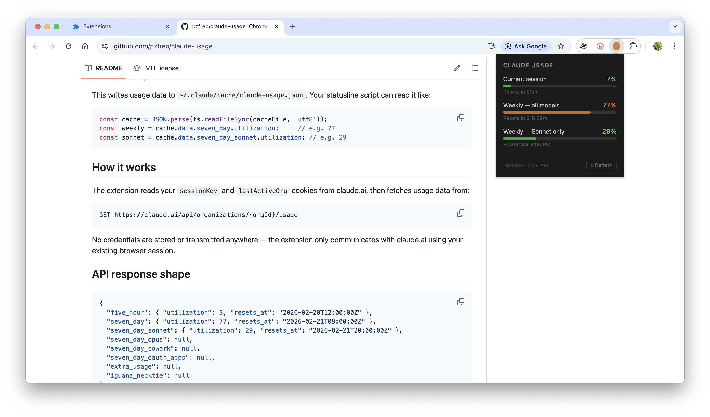
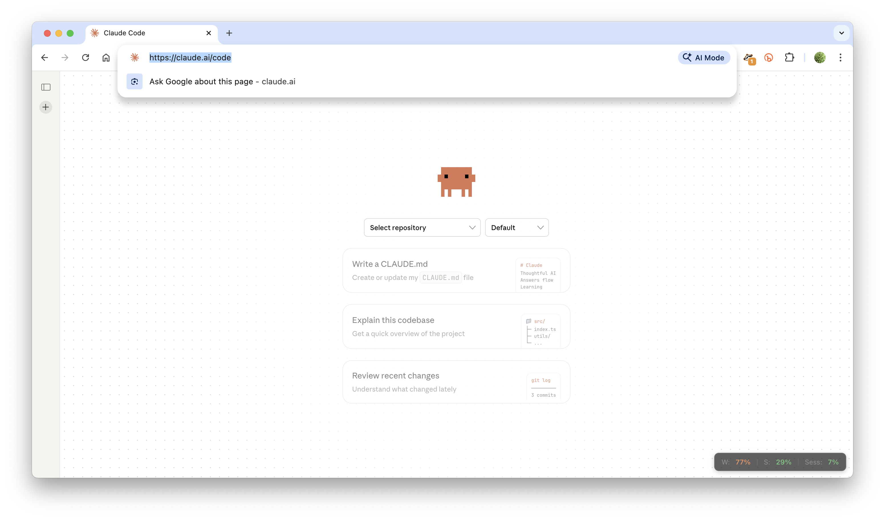
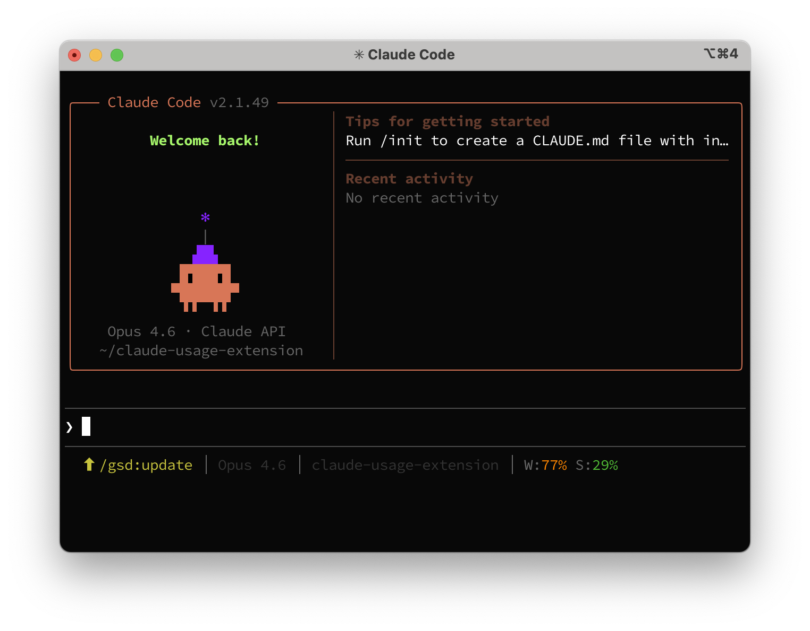

# Claude Usage

A Chrome extension that shows your Claude plan usage limits at a glance.


| Popup + Badge | Overlay on claude.ai | Claude Code Statusline |
|:---:|:---:|:---:|
|  |  |  |

## Features

- **Toolbar badge** — shows weekly usage percentage, color-coded (green → yellow → orange → red)
- **Popup** — click the icon for full breakdown with progress bars and reset times
- **Floating overlay** — persistent usage pill on claude.ai pages (bottom-right corner)
- **Claude Code statusline** — optional bridge writes usage data to `~/.claude/cache/` for terminal integration

Auto-refreshes every minute. No API keys or manual configuration needed — reads your existing claude.ai session cookies.

## Install

1. Clone or download this repo
2. Open `chrome://extensions` in Chrome
3. Enable **Developer mode** (top right)
4. Click **Load unpacked** and select this folder
5. Log in to [claude.ai](https://claude.ai) if you aren't already

The badge will show your weekly usage percentage immediately.

## What it shows

| Metric | Badge | Popup | Overlay |
|--------|-------|-------|---------|
| Weekly — all models | ✓ (color) | ✓ (bar + reset time) | ✓ |
| Weekly — Sonnet only | | ✓ (bar + reset time) | ✓ |
| Current session | | ✓ (bar + reset time) | ✓ |

## Optional: Claude Code statusline integration

If you use [Claude Code](https://docs.anthropic.com/en/docs/claude-code), you can bridge the usage data to the terminal statusline via Chrome Native Messaging.

### Setup

```bash
cd native-host
./install.sh <your-extension-id>
```

Find your extension ID at `chrome://extensions` (enable Developer mode — it's the 32-character string under the extension name).

This writes usage data to `~/.claude/cache/claude-usage.json`. Your statusline script can read it like:

```js
const cache = JSON.parse(fs.readFileSync(cacheFile, 'utf8'));
const weekly = cache.data.seven_day.utilization;     // e.g. 77
const sonnet = cache.data.seven_day_sonnet.utilization; // e.g. 29
```

## How it works

The extension reads your `sessionKey` and `lastActiveOrg` cookies from claude.ai, then fetches usage data from:

```
GET https://claude.ai/api/organizations/{orgId}/usage
```

No credentials are stored or transmitted anywhere — the extension only communicates with claude.ai using your existing browser session.

## API response shape

```json
{
  "five_hour": { "utilization": 3, "resets_at": "2026-02-20T12:00:00Z" },
  "seven_day": { "utilization": 77, "resets_at": "2026-02-21T09:00:00Z" },
  "seven_day_sonnet": { "utilization": 29, "resets_at": "2026-02-21T20:00:00Z" },
  "seven_day_opus": null,
  "seven_day_cowork": null,
  "seven_day_oauth_apps": null,
  "extra_usage": null,
  "iguana_necktie": null
}
```

## License

MIT
